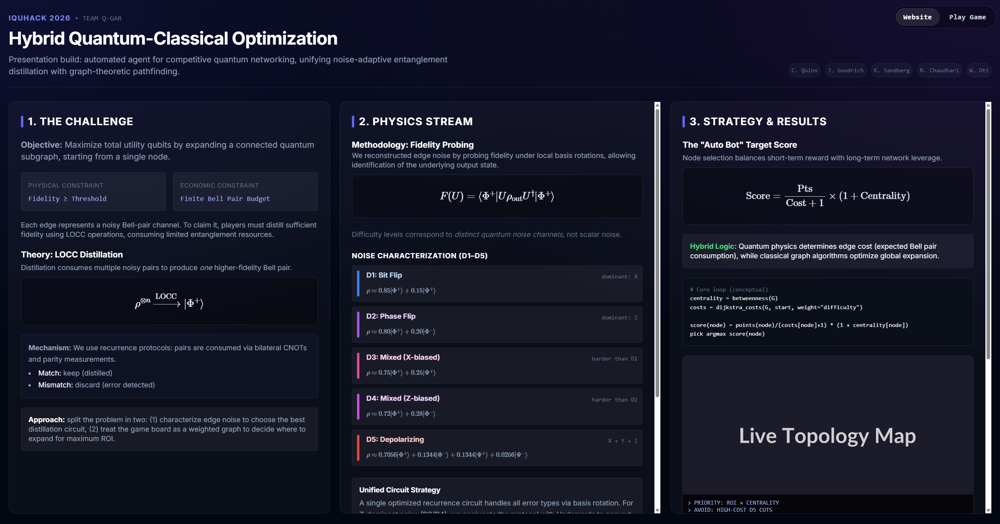
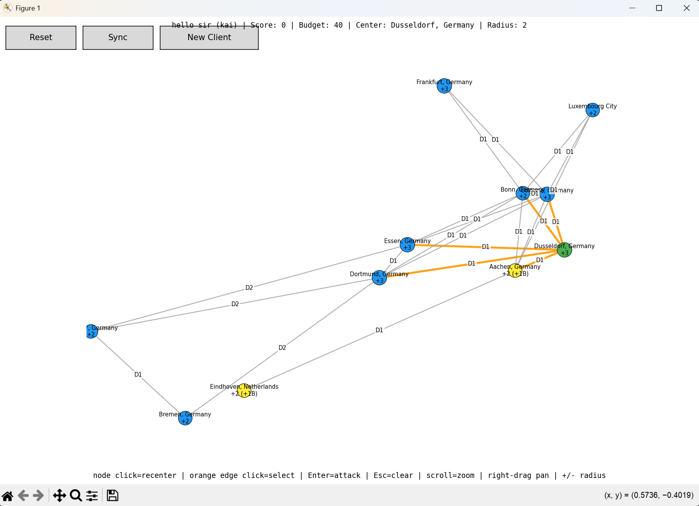

## iQuHack 2026 — Entanglement Distillation Game (IonQ)

Our hackathon project: a **circuit toolkit + strategy layer + visual clients** for the entanglement distillation game.

- **Circuit focus**: reusable OpenQASM 3 / Qiskit templates with explicit `flag_bit` post-selection.
- **Score focus**: maximize the game’s effective edge contribution \(F \cdot p\) while clearing thresholds.
- **Strategy focus**: expand toward high-value nodes (utility + bonus) and manage failure streaks.
- **Workflow focus**: iterate quickly via notebook + interactive/auto visualizers + web UI.

### Table of contents

- [Quickstart](#quickstart)
- [Website](#website)
- [Game (web)](#game-web)
- [How we play](#how-we-play)
- [Project structure](#project-structure)
- [Configuration](#configuration)

### Quickstart

#### Install (Windows PowerShell)

```powershell
cd 2026-IonQ
python -m venv .venv
.\.venv\Scripts\Activate.ps1
pip install -r requirements.txt
```

#### Install (macOS/Linux)

```bash
cd 2026-IonQ
python3 -m venv .venv
source .venv/bin/activate
pip install -r requirements.txt
```

#### Notebook workflow (recommended)

Open `demo.ipynb` (VS Code or Jupyter). It includes **session save/load** via `session.json` so you don’t have to re-register every time.

### Website

The hackathon website lives in `ionqwebsite/`:

- **Entry point**: `ionqwebsite/index.html` (redirects to `iQuhackweb.html`)
- **Main page**: `ionqwebsite/iQuhackweb.html`



To view locally (recommended: use the same dev server as the game so relative assets work):

```bash
cd 2026-IonQ/ionqwebsite
python proxy_server.py
```

Then open `http://localhost:5173/iQuhackweb.html` (or just `http://localhost:5173/`).

### Game (web)

The playable web client lives in `ionqwebsite/web_client.html`.


Start the local proxy server (CORS + static):

```bash
cd 2026-IonQ/ionqwebsite
python proxy_server.py
```

Then open `http://localhost:5173/web_client.html`.

#### Python visualizers



```bash
cd 2026-IonQ
python "interactive game/interactive_viz.py"
```

```bash
cd 2026-IonQ
python "interactive game/greedy_auto_viz.py"
```

### How we play

- **Start**: pick a starting node balancing immediate utility vs bonus bell-pairs.
- **Attack selection**: prefer edges that lead to high-value targets; deprioritize D4/D5 unless we’re stuck.
- **Circuit selection**: use templates from `distillation_circuits.py`; tune \(N\) and post-selection so \(F \cdot p\) stays strong and clears the threshold.
- **Iterate fast**: use `interactive_viz.py` / `web_client.html` to reduce “guess → run → see result” time.

### Project structure

```text
2026-IonQ/
  demo.ipynb                 Notebook “home base” (register, play, iterate)
  client.py                  GameClient (API wrapper + claim helpers)
  distillation_circuits.py    Circuit library / templates

  visualization.py           Static graph utilities (NetworkX/Matplotlib)
  interactive game/           Python gameplay tools
    interactive_viz.py        Interactive map + “click edge, attack” workflow
    greedy_auto_viz.py        Auto-running greedy strategy visualizer

  ionqwebsite/                Website + web client bundle
    index.html                Redirect entrypoint
    iQuhackweb.html           Website / submission page
    site.html                 Static page (alt landing)
    web_client.html           Web game client UI
    proxy_server.py           Local static server + CORS proxy for web client
    api/proxy.js              Vercel-style serverless proxy (optional deployment)

  animations/                 Animation experiments + network notebooks
  graph_search_algorithms/    Strategy/bot experiments and variants

  game_handbook.md            Game rules (LOCC constraints, scoring, etc.)
  requirements.txt            Python dependencies
  session.json                Local saved token/session (do not commit)
  assets/                     Place screenshots for GitHub README
```

### Configuration

- **Upstream server**: defaults to `https://demo-entanglement-distillation-qfhvrahfcq-uc.a.run.app`.
  - **Python**: pass `base_url=...` to `GameClient(...)`.
  - **Web/proxy**: set `UPSTREAM_BASE_URL` if you need to point elsewhere.
